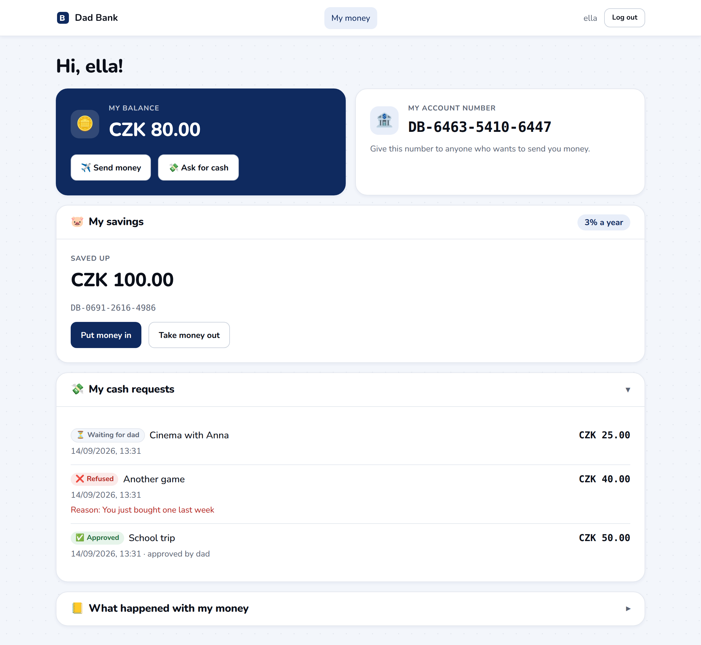
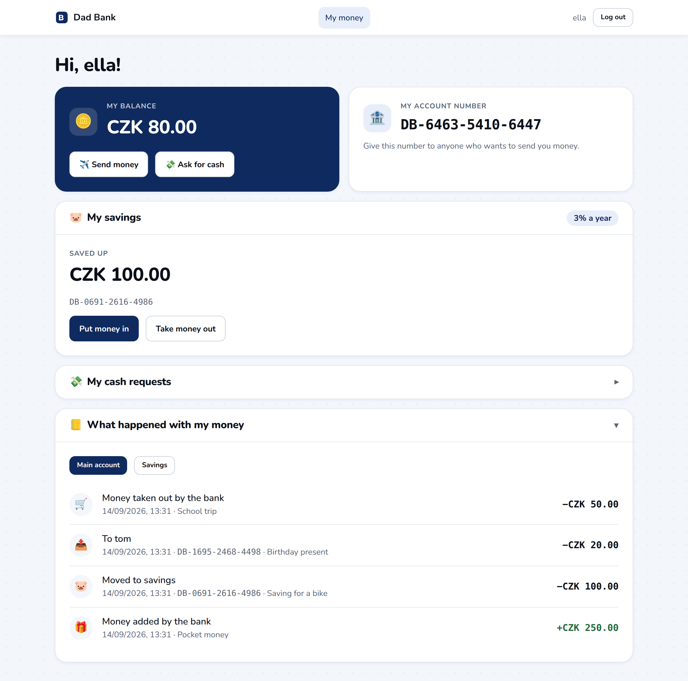
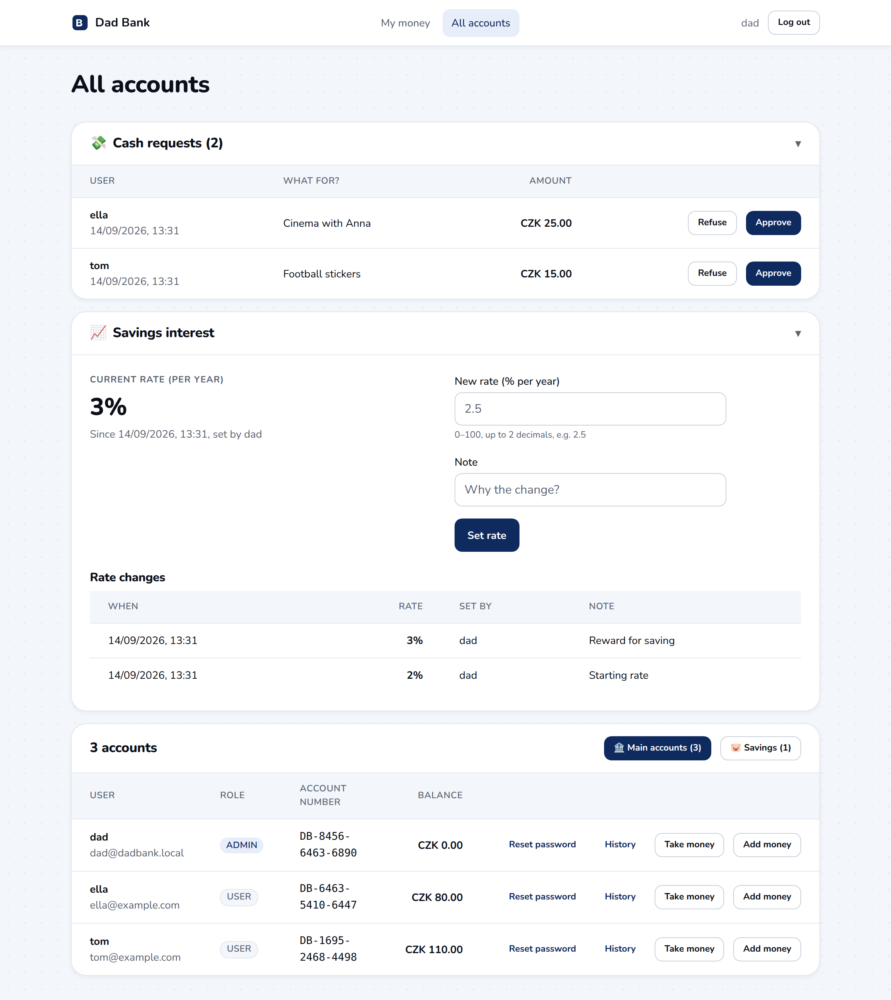
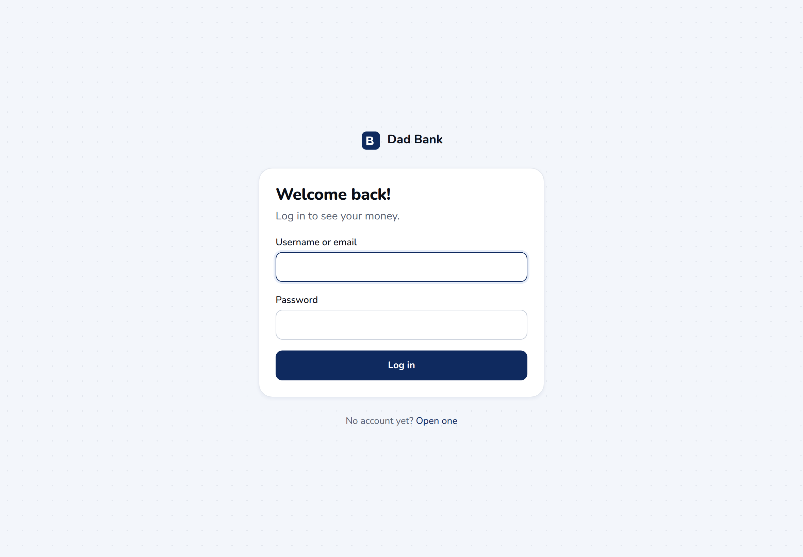

# Dad Bank

An educational banking app for families. Parents run "the bank", kids get their own account number,
send money to each other, save up at an interest rate the parent sets, and ask for cash — which the
parent approves or refuses. The point is that every abstract banking word (balance, transfer, ledger,
interest, savings) becomes something the kid can actually do.

```
backend/   Spring Boot 3 (Java 21, Maven wrapper) · SQLite · JWT
frontend/  React 19 + TypeScript (Vite) · React Query · plain CSS with design tokens
```

## Screenshots

Running with `VITE_LOCALE=en` and a seeded demo family.

| A kid's dashboard | Where the money went |
| --- | --- |
| [](docs/screenshots/dashboard.png) | [](docs/screenshots/history.png) |
| Balance, savings with the current rate, and cash requests with their status. | The ledger per account, main or savings, newest first. |

| The parent's view | Signing in |
| --- | --- |
| [](docs/screenshots/admin.png) | [](docs/screenshots/login.png) |
| Cash requests waiting for a decision, the savings rate and its change log, and every account. | Kids register themselves; the parent account is seeded. |

---

## Quick start

Fork or clone, then start the two halves. There is nothing to configure first — the database file
and the admin user are created on the first run.

### Backend

Needs a **JDK 21 or newer** and nothing else: `./mvnw` downloads Maven itself on first use.

```bash
cd backend
./mvnw test              # integration tests (see Testing below)
./mvnw spring-boot:run   # API on http://localhost:8080
```

- API on `http://localhost:8080/api`
- SQLite file created at `backend/data/dadbank.db`
- Admin (god mode) is seeded on first start: **dad / dad12345** (`dad@dadbank.local`)

Optional extras, neither of which a plain run needs:

- `./mvnw -Pquality verify` additionally runs SpotBugs, which fails the build on any finding. It is a
  profile so that a fresh clone builds green on any machine; run it before pushing, and in CI.
- To pin the build to Java 21 regardless of the JDK on your PATH, copy `backend/toolchains.xml.example`
  to `backend/toolchains.xml` and set `jdkHome`. The `jdk-toolchain` profile activates itself when that
  file exists. It is gitignored, because the path is specific to your machine.

Override anything via env vars: `DADBANK_ADMIN_USERNAME`, `DADBANK_ADMIN_PASSWORD`, `DADBANK_ADMIN_EMAIL`,
`DADBANK_JWT_SECRET`, `DADBANK_JWT_EXPIRATION_MINUTES`, `DADBANK_DB_PATH`, `DADBANK_CORS_ORIGINS`.

### Frontend

Needs **Node 20.19+ or 22.12+** (Vite 8).

```bash
cd frontend
npm install
npm run dev           # http://localhost:5173, proxies /api -> :8080
```

Pages: `/register`, `/login`, `/` (kid dashboard), `/admin` (admin only).

---

## How the bank works

**Roles.** `USER` is a kid: they see only their own accounts. `ADMIN` is the parent ("god mode"): they see
every account, move money in and out, decide cash requests, set the interest rate and reset passwords.
The admin is seeded from config, kids register themselves.

**Accounts.** Every user gets one `CHECKING` account at registration with a generated number
(`DB-1234-5678-9012`). Each user may additionally open exactly one `SAVINGS` account, which earns the
bank-wide interest rate. Uniqueness is enforced on `(user_id, type)`.

**Money is always integer cents** (`long` in Java, `number` in TS). Formatting happens only at the edge
(`formatMoney`), never in the domain. No floating point anywhere near a balance.

**The ledger.** `transactions` is append-only and is the story of the money:

| Type         | From       | To         | Written when                                                                |
| ------------ | ---------- | ---------- | --------------------------------------------------------------------------- |
| `TRANSFER`   | an account | an account | kid → kid, or a kid moving money between their own main and savings account |
| `DEPOSIT`    | —          | an account | admin puts money in (pocket money, a gift)                                  |
| `WITHDRAWAL` | an account | —          | admin takes money out, or a cash request is approved                        |

Deposits and withdrawals have one side null rather than pointing at a fake "bank" account, so a row never
lies about where money came from. Each API response renders a row from _one account's_ point of view:
`direction` is `IN`/`OUT` and `counterparty` is the other side (null for deposits/withdrawals).

**Cash requests** live in their own table because they have a lifecycle: `PENDING → APPROVED | REJECTED`.
Nothing moves while a request is pending; approval is the only thing that debits the account, and it
writes the `WITHDRAWAL` ledger row in the same database transaction.

**Interest** is stored in basis points (`250` = 2.5 % per year) as one row per change, with who changed it,
when and why. The newest row is the rate in force; the history is kept so the rate can be charted and so a
future payout job can do back-dated maths correctly.

---

## API

All endpoints are under `/api`, JSON only. Authentication is a JWT in `Authorization: Bearer <token>`.

Errors are always `{"message": "...", "errors": {"field": "msg"}}`:
`400` validation / malformed, `401` bad credentials or no token, `403` not an admin, `404` unknown resource,
`409` conflict (name taken, savings already open, request already decided), `422` insufficient funds.

### Auth & profile

| Method | Path                 | Auth   | Notes                                                                            |
| ------ | -------------------- | ------ | -------------------------------------------------------------------------------- |
| POST   | `/api/auth/register` | —      | `{email, username, password}` → `201 {token, user}`                              |
| POST   | `/api/auth/login`    | —      | `{login, password}` — `login` is the username **or** the email → `{token, user}` |
| GET    | `/api/me`            | Bearer | current user + `account` (CHECKING) + `savings` (SAVINGS or null)                |

### Moving money

| Method | Path                    | Auth   | Notes                                                                                                                                         |
| ------ | ----------------------- | ------ | --------------------------------------------------------------------------------------------------------------------------------------------- |
| POST   | `/api/transfers`        | Bearer | `{toAccountNumber, amountCents, note?}` → `201 {transaction, balanceCents}`; 422 insufficient funds, 400 self-transfer, 404 unknown recipient |
| POST   | `/api/savings`          | Bearer | open the caller's savings account → `201 AccountDto`; 409 if they already have one                                                            |
| POST   | `/api/savings/deposit`  | Bearer | `{amountCents, note?}` main → savings → `201 {transaction, checkingBalanceCents, savingsBalanceCents}`                                        |
| POST   | `/api/savings/withdraw` | Bearer | same, savings → main; 422 if savings can't cover it                                                                                           |

### History

| Method | Path                                    | Auth   | Notes                                                                                                                                                                                                           |
| ------ | --------------------------------------- | ------ | --------------------------------------------------------------------------------------------------------------------------------------------------------------------------------------------------------------- |
| GET    | `/api/transactions?page=0&size=20`      | Bearer | own history, newest first → `{items, page, size, totalItems, totalPages}`; each item has `type`, `direction`, `amountCents`, `note`, `counterparty {accountNumber, username, accountType}` or null, `createdAt` |
| GET    | `/api/transactions?account=SAVINGS`     | Bearer | the savings account's history (default is `CHECKING`)                                                                                                                                                           |
| GET    | `/api/admin/accounts/{id}/transactions` | ADMIN  | same shape, for any account                                                                                                                                                                                     |

### Cash requests

| Method | Path                                  | Auth   | Notes                                                                                                                  |
| ------ | ------------------------------------- | ------ | ---------------------------------------------------------------------------------------------------------------------- |
| POST   | `/api/withdrawals`                    | Bearer | `{amountCents, note?}` → `201` PENDING; 422 if it already exceeds the balance                                          |
| GET    | `/api/withdrawals`                    | Bearer | own requests, every status, newest first                                                                               |
| GET    | `/api/admin/withdrawals/pending`      | ADMIN  | the queue, oldest first, with `username` and `accountNumber`                                                           |
| POST   | `/api/admin/withdrawals/{id}/approve` | ADMIN  | debits the account + writes the `WITHDRAWAL` row → `{withdrawal, balanceCents}`; 422 out of funds, 409 already decided |
| POST   | `/api/admin/withdrawals/{id}/reject`  | ADMIN  | `{reason}` (required, ≤140 chars) → same shape; the balance is untouched                                               |

### Interest

| Method | Path                  | Auth   | Notes                                                                  |
| ------ | --------------------- | ------ | ---------------------------------------------------------------------- |
| GET    | `/api/interest`       | Bearer | `{rateBps}` — yearly rate in basis points; `0` until an admin sets one |
| GET    | `/api/admin/interest` | ADMIN  | every change, newest first: `{id, rateBps, setBy, note, createdAt}`    |
| POST   | `/api/admin/interest` | ADMIN  | `{rateBps (0–10000), note?}` → `201`                                   |

### Admin

| Method | Path                                 | Auth  | Notes                                                                                                 |
| ------ | ------------------------------------ | ----- | ----------------------------------------------------------------------------------------------------- |
| GET    | `/api/admin/accounts`                | ADMIN | every account: `{accountId, userId, username, email, role, accountType, accountNumber, balanceCents}` |
| POST   | `/api/admin/accounts/{id}/deposit`   | ADMIN | `{amountCents, note?}` → `201 {transaction, balanceCents}`                                            |
| POST   | `/api/admin/accounts/{id}/withdraw`  | ADMIN | same; 422 if the account can't cover it                                                               |
| POST   | `/api/admin/users/{userId}/password` | ADMIN | `{newPassword}` (8–128 chars) → `204`; existing tokens stay valid until they expire                   |

### Quick check with curl

```bash
curl -s -X POST localhost:8080/api/auth/register -H 'Content-Type: application/json' \
  -d '{"email":"kid@example.com","username":"kiddo","password":"password123"}'
TOKEN=$(curl -s -X POST localhost:8080/api/auth/login -H 'Content-Type: application/json' \
  -d '{"login":"kiddo","password":"password123"}' | sed 's/.*"token":"\([^"]*\)".*/\1/')
curl -s localhost:8080/api/me -H "Authorization: Bearer $TOKEN"
```

---

## Frontend

```
src/
  api/          fetch wrapper (ApiError, token storage) + one module per resource
  features/     one folder per area: React Query hooks in queries.ts + that area's components
  components/
    ui/         Button, Field, MoneyField, Card, Dialog, Table, Alert, Badge, Stat, Spinner
    layout/     AppShell (signed-in pages), AuthLayout (login/register)
  pages/        route components; they compose features, they never call fetch
  auth/         RequireAuth route guard (role-aware)
  lib/          the React Query client and its retry policy
  styles/       tokens.css (the whole look) + base.css (reset + a few utilities)
  i18n/         en.json, cs.json, t()
  money.ts      cents <-> display: formatMoney, parseMoney, validateAmount, formatRate, formatDate
```

Conventions worth keeping (also in [`src/components/README.md`](frontend/src/components/README.md)):

- **Data goes through React Query hooks** in `features/<area>/queries.ts`. Mutations patch the cached
  balance from the response and then invalidate, so a number never sits stale after an action.
- **Change the look in `tokens.css`**, not in components: colors (white / near-black / dark blue), type
  scale, 4px spacing, radii, shadows. Components use BEM-ish class names and one `.css` file each.
- **No user-visible string lives in a component** — everything goes through `t('section.key')`.

---

## Languages

Strings live in `frontend/src/i18n/`, one JSON file per language, and the language is chosen **at
start-up** — there is no in-app switcher yet.

### Switching language

`VITE_LOCALE` in `frontend/.env` decides it (`cs` by default):

```bash
# frontend/.env
VITE_LOCALE=cs
```

To run in another language without touching a tracked file, create `frontend/.env.local` (gitignored):

```bash
echo "VITE_LOCALE=en" > frontend/.env.local
```

Vite reads env files at start, so **restart `npm run dev`** after changing either file. An unknown value
falls back to `cs`.

### Adding a language

1. Copy `src/i18n/en.json` to `src/i18n/<code>.json` and translate the values. Keep the keys and the
   `{placeholders}` exactly as they are — `{name}`, `{amount}`, `{rate}` are substituted at runtime.
2. Register it in `src/i18n/index.ts`:

   ```ts
   import de from "./de.json";

   export const LOCALES = { en, cs, de } as const;
   ```

3. Give it a BCP-47 tag for number, currency and date formatting in the same file:

   ```ts
   const INTL_TAGS: Record<Locale, string> = {
     en: "en-GB",
     cs: "cs-CZ",
     de: "de-DE",
   };
   ```

4. Set `VITE_LOCALE=de` and restart the dev server.

Notes:

- `en.json` is the source of truth for the key type, so `t('typo.key')` fails the TypeScript build.
- A key missing from a translation renders the key itself (`savings.putIn`) instead of silently showing
  English — easy to spot in the UI.
- Currency is still CZK everywhere; it is a parameter of `formatMoney()` if that ever needs to change.
- Backend error messages (`"Insufficient funds"`) are English. They are few and are shown verbatim; if
  they should be translated, map them by status + field on the frontend rather than localising the API.

---

## Database

SQLite, one file, schema managed by Hibernate `ddl-auto: update`.

```
users          id, email (uniq), username (uniq), password_hash, role, created_at
accounts       id, user_id (FK), type (CHECKING|SAVINGS, unique per user+type),
               account_number (uniq), balance_cents, created_at
transactions   id, type (TRANSFER|DEPOSIT|WITHDRAWAL), from_account_id?, to_account_id?,
               amount_cents, note, created_at
withdrawals    id, account_id (FK), amount_cents, note, status (PENDING|APPROVED|REJECTED),
               created_at, decided_by_user_id?, decided_at?, rejection_reason?, transaction_id?
interest_rates id, rate_bps, set_by_user_id (FK), note, created_at
```

> **Resetting.** `ddl-auto: update` adds tables and columns but cannot change an existing column or
> constraint, and SQLite cannot alter them in place either. After a schema change of that kind, delete
> `backend/data/dadbank.db` and start again — it is dev data and the admin is re-seeded automatically.
> Proper migrations (Flyway) are on the roadmap and are the prerequisite for keeping real data.

---

## Testing

`cd backend && ./mvnw test` runs MockMvc integration tests against the real stack (SQLite included), one
class per flow:

| Class                | Covers                                                                                            |
| -------------------- | ------------------------------------------------------------------------------------------------- |
| `AuthFlowTest`       | register, duplicate email/username, login by name or email, `/me`, 401/403, validation            |
| `TransferFlowTest`   | transfers both ways, insufficient funds, self-transfer, unknown recipient, admin deposit/withdraw |
| `HistoryFlowTest`    | ledger from both sides, ordering, paging, admin access to any account                             |
| `SavingsFlowTest`    | opening savings (and the 409), moving money both ways, per-account history, interest rate rules   |
| `WithdrawalFlowTest` | request → reject with reason → request → approve, balance and ledger effects, 409/422 guards      |
| `AdminUserFlowTest`  | password reset, old password rejected, permissions                                                |

`./mvnw -Pquality verify` adds SpotBugs on top. The compiler runs with `-Xlint:all -Werror`, so a warning
fails the build.

The frontend has no test runner yet (see below). `npm run typecheck` runs `tsc` on its own, `npm run build`
type-checks and bundles, and `npm run lint` runs oxlint.

---

## Future improvements

Roughly in the order they would add the most value.

**Finish the savings story**

- **Interest payout job** — a scheduled task crediting `balance × rate × days / 365` as a new `INTEREST`
  ledger row, so the kid watches the money grow on its own. The rate history makes back-dated maths correct.
- **Interest rate chart** on the admin page — the data is already collected, it only needs rendering.
- **Savings goals ("jars")** — name a goal and an amount, show progress towards it.

**Features**

- **Recurring pocket money** — a standing order the admin sets once per kid.
- **Avatars** and a per-kid colour, so a young child recognises their own account at a glance.
- **In-app language switcher** — the strings are already externalised; this needs the locale in React state
  (or on the user record) instead of an env variable.
- **Introduce loans** - new section where kid can take a loan, approval process through dad, intent to get money, interest,
  and visual charts on how much kid can loan in coparision with the paying back amount and time

**Hardening**

- **Flyway migrations** instead of `ddl-auto: update` — required before there is data worth keeping.
- **Refresh tokens and login rate limiting**; today a JWT is valid until it expires and a password reset
  does not invalidate old tokens.
- **Frontend tests** — Vitest for `parseMoney`/`validateAmount`/`t()`, and a Playwright pass over the main
  flows (they are currently checked by hand).
- **Docker Compose** for one-command startup, and Postgres instead of SQLite if it ever runs for real.
- **Audit trail for admin actions** — deposits and withdrawals record who did them only indirectly.
